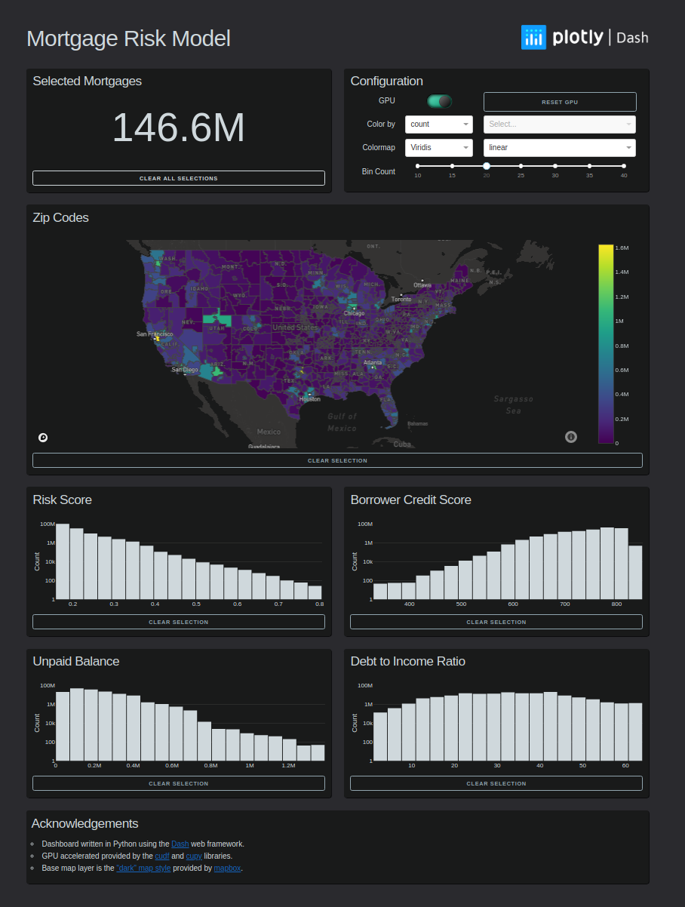

## Dash + RAPIDS Demo
This repository contains an example plotly [Dash](https://plot.ly/dash/) app that uses several technologies from the [RAPIDS](https://rapids.ai/) ecosystem to support interactive cross filtering on a 146 million row mortgage dataset.



## Hardware requirements
This demo requires a [RAPIDS-compatible](https://rapids.ai/start.html) NVIDIA GPU with at least 11GB of memory. It was developed using a [GeForce RTX 2080 Ti](https://www.nvidia.com/en-us/geforce/graphics-cards/rtx-2080-ti/).

Note: The RAPIDS ecosystem is currently only supported on Linux.

## Mapbox setup
To run the dashboard, create a file name `.mapbox_token` under to root directory. This file should contain a valid Mapbox token, which can be obtained for free by setting up an account at https://www.mapbox.com/.

Alternatively, set the `MAPBOX_TOKEN` environment variable to a valid mapbox token before launching the dashboard. 

## Environment setup
To run the dashboard, create and activate a [conda](https://docs.conda.io/en/latest/) environment from the included `environment.yml` file: 
```
$ conda env create -f environment.yml
$ conda activate rapids_mortgage_dashboard
```

Then launch the dashboard for development
```
$ python app.py
``` 

Or, launch for production using gunicorn with:
```
$ gunicorn 'app:server()'
```

Note: A current limitation is that using multiple gunicorn workers will result in starting multiple Dask clusters.

The first time the dashboard runs, it will download and decompress the mortgage dataset into the `./data` directory. This will consume ~3.4GB of disk space. 

## Example Usage
### Cross filtering on histograms and choropleth
Cross filtering is performed across histogram and choropleth selections.  The top left card displays the number of rows that are currently selected.


### Configure number of histogtram bins with slider
The slider in the top right configuration card can be used to change the number of bins in each histogram.


### Configure choropleth aggregation and coloring
The controls in the top right configuration card can be used to configure how the choropleth is colored, the colorscale to use, and a colorscale transformation.
  


### Compare CPU vs GPU performance
The GPU toggle in the top right configuration card can be used to disable GPU acceleration. When the toggle is off, all operations are performed on the CPU using [numpy](https://numpy.org/) and [pandas](https://pandas.pydata.org/). When the toggle is on, most operations are performed on the GPU using [CuPy](https://cupy.chainer.org/) and [cuDF](https://github.com/rapidsai/cudf).  The CPU implementation is generally more than an order of magnitude slower than the GPU implementation. 


